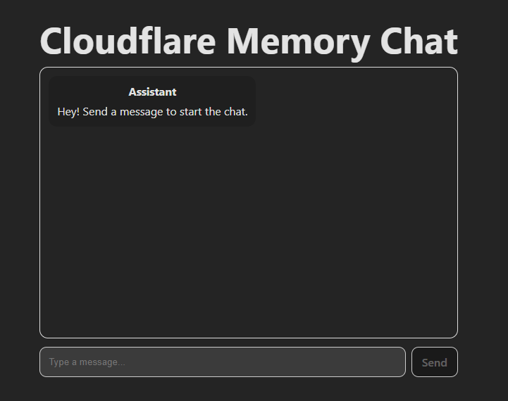
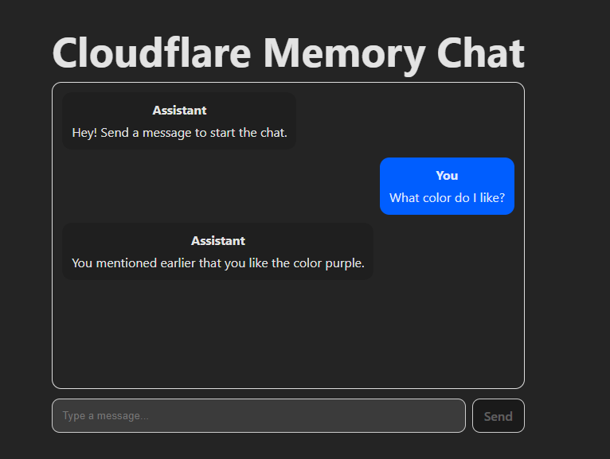
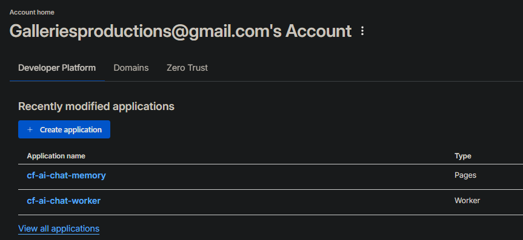

# 📌 Cloudflare AI Memory Chat

A minimal, production-ready AI chat application built for the **Cloudflare AI Technical Assignment**.
It demonstrates:

* **Workers AI** (LLM: LLaMA 3.3)
* **Durable Objects** for persistent conversation memory
* **Cloudflare Worker backend**
* **Cloudflare Pages frontend**
* **End-to-end chat UI with stateful memory**

Live demo: **[https://1d796083.cf-ai-chat-memory-9dc.pages.dev/](https://1d796083.cf-ai-chat-memory-9dc.pages.dev/)**

---

## 🚀 Features

### ✔ AI-Powered Responses

Uses **Workers AI** to generate responses using Cloudflare's LLaMA 3.3 model.

### ✔ Durable Objects Memory

Each session gets its own **Durable Object instance**, storing message history server-side.
Memory persists across messages and allows the AI to recall earlier user statements.

### ✔ Modern Chat Interface

A clean, simple UI built with **React + Vite**, deployed on Cloudflare Pages.

### ✔ End-to-End Cloudflare Stack

Everything runs natively on Cloudflare:

* Pages (static frontend)
* Worker (API)
* Durable Object (memory)
* Workers AI (LLM inference)

No external servers required.

---

## 🧱 Architecture

```
frontend/   → React/Vite chat interface (Cloudflare Pages)
worker/     → Cloudflare Worker API + Durable Object
  ├─ src/
  │   ├─ index.ts         → Worker routing
  │   ├─ chat-session.ts  → Durable Object logic (memory)
  ├─ wrangler.jsonc       → Bindings (AI + Durable Object)
```

---

## 📸 Screenshots

### 🖼 Main Chat UI  


### 🧠 Memory Example  


### 🚀 Cloudflare Deployment (Worker + Pages)  


---

## 🔥 How It Works

### 1. The frontend sends messages to:

```
POST /api/chat
```

### 2. The Worker forwards the message to the correct Durable Object:

```
env.CHAT_DO.get(idFromName(sessionId))
```

### 3. The Durable Object:

* Loads stored history
* Appends the new user message
* Calls Workers AI with full history
* Saves updated history
* Returns the AI response

### 4. The frontend displays the conversation in the chat UI.

---

## 🛠️ Running Locally

### 1. Clone the repo

```bash
git clone https://github.com/gallerymiguel/cf_ai_chat_memory
cd cf_ai_chat_memory
```

### 2. Install frontend dependencies

```bash
cd frontend
npm install
npm run dev
```

### 3. Start the Worker (local mode)

```bash
cd ../worker
npx wrangler dev --local
```

Local API URL:

```
http://127.0.0.1:8787/api/chat
```

---

## 🌐 Deployment

### Deploy Worker

```bash
cd worker
npx wrangler deploy
```

### Deploy Frontend (via Cloudflare Pages)

* Connect GitHub repo
* Framework preset: **None**
* Build command: `npm run build`
* Output directory: `dist`
* Environment variable:

  ```
  VITE_API_BASE=https://<your-worker-subdomain>.workers.dev
  ```

---

## 🧪 Testing API

### Check memory:

```bash
curl "https://<your-worker>/api/history?sessionId=test123"
```

### Send message:

```bash
curl -X POST https://<your-worker>/api/chat \
  -H "content-type: application/json" \
  -d '{"sessionId":"test123","message":"Hello!"}'
```

---

## 📄 PROMPTS.md

This repo includes a `PROMPTS.md` file containing all AI-assisted prompts used during development, per assignment instructions.

---

## 🔒 Notes on Originality

All logic, implementation, and structure were created specifically for this assignment.
AI assistance was used as allowed and all prompts are documented.

---

## 🎉 Final Result

A fully deployed, end-to-end Cloudflare AI application featuring:

* Stateful chat memory
* Durable Objects
* Workers AI
* A clean, production-ready UI
* Clear documentation
* Reproducible setup

Perfect for demonstrating Cloudflare platform knowledge.

---

